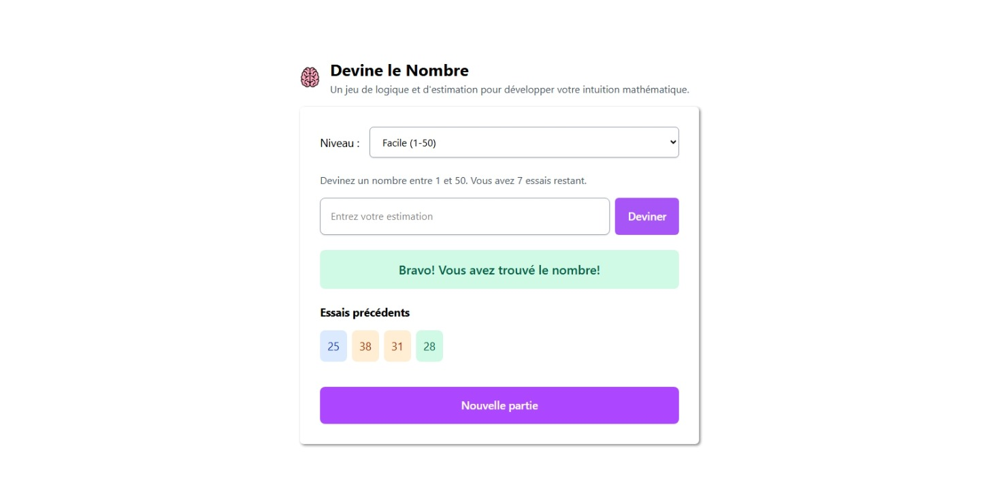

# 🎯 Number Guessing Game

A simple and interactive number guessing game built with **React** and **TailwindCSS**. Get real-time feedback on your guesses: too high, too low, or just right — with a clean and responsive UI.

---

## 🚀 Features

- ✅ Real-time feedback (Too high / Too low / Correct)
- 🎨 Dynamic styling with TailwindCSS
- 🔁 "New Game" button to restart anytime
- 💡 Game logic separated into clean components
- 📱 Fully responsive layout

---

## 📸 Preview



---

## 🛠️ Tech Stack

- [React](https://reactjs.org/)
- [TailwindCSS](https://tailwindcss.com/)
- TypeScript (optionally)

---

## 📦 Installation

```bash
git clone https://github.com/your-username/number-guessing-game.git
cd number-guessing-game
npm install
npm run dev
```
